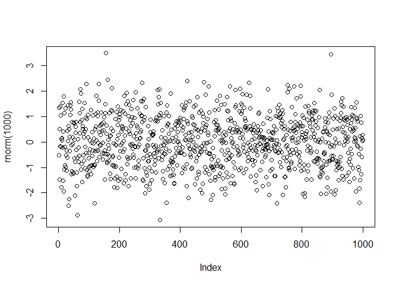

<!-- README.md is generated from README.Rmd. Please edit that file -->

# bayesROE

<!-- badges: start -->

[](https://lifecycle.r-lib.org/articles/stages.html#stable)
<!-- badges: end -->

The goal of bayesROE is to provide an R package and Shiny application
for easy computation and visualization of Bayesian Regions of Evidence
as described by Hoefler and Miller (2023). [OSF Project
History](https://osf.io/jxnsv/)

## Installation

You can install the development version of bayesROE like so:

``` r
remotes::install_github(repo = "waidschrat/bayesROE", subdir = "pkg")
```

## Example

This is a basic example illustrates the Esketamine example for one
non-inferiority and two superiority thresholds:

``` r
# library(bayesROE)
## basic example code
```

The resulting plot is shown here:


