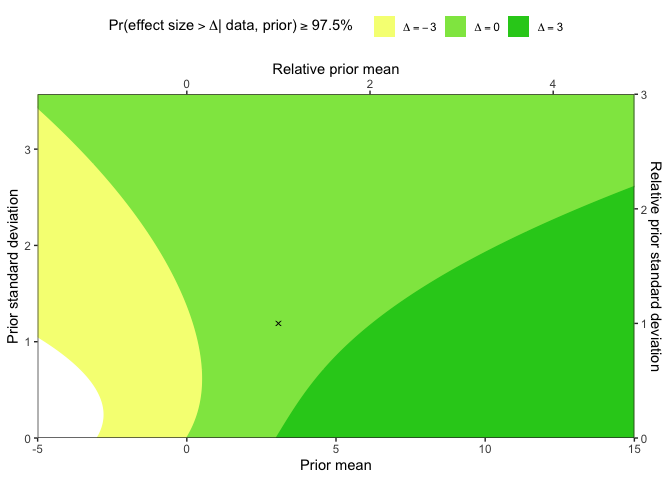

<!-- README.md is generated from README.Rmd. Please edit that file -->

# bayesROE

<!-- badges: start -->

[](https://lifecycle.r-lib.org/articles/stages.html#stable)

[](https://CRAN.R-project.org/package=bayesROE)
[](https://app.codecov.io/gh/waidschrat/bayesROE?branch=main)
<!-- badges: end -->

The goal of bayesROE is to provide an R package and a Shiny User
Interface for easy computation and visualization of Bayesian regions of
evidence as described by Hoefler and Miller (2023): [Project History on
Open Science Framework](https://osf.io/jxnsv/). Such regions of evidence
serve to systematically probe the sensitivity of a superiority or
non-inferiority claim against any prior assumption of its assessors.
Thus, their presentation aids research transparency and scientific
evaluation of study findings. Besides generic functions, the package
also provides an intuitive user interface for a Shiny application, that
can be run in a local R environment.

## Installation

You can install the development version of bayesROE like so:

``` r
remotes::install_github(repo = "waidschrat/bayesROE")
```

## Example

This is a basic example illustrates the Esketamine example for one
non-inferiority and two superiority thresholds:

``` r
library(bayesROE)

# Arguments to reproduce Figure 3 (Appendix) from Hoefler and Miller (2023)
init <- list(ee = 9, se = 3.9, delta = c(0, 3.75), alpha = 0.025)
cols <- list(col_lower = "#F5FF82", col_upper = "#27CC1E")

# Plot Regions of Evidence
library(ggplot2)
#> Warning: Paket 'ggplot2' wurde unter R Version 4.1.3 erstellt
HM23.3 <- ribbonROE(ee = init$ee, se = init$se, delta = init$delta, alpha = init$alpha, 
                    cols = c(cols$col_lower, cols$col_upper))$plot + 
  annotate(geom = "point", y = init$ee, x = init$se, shape = 4) +
  coord_flip(ylim = c(-5, 15))
#> Coordinate system already present. Adding new coordinate system, which will
#> replace the existing one.

# Alternatively Pass Arguments to Local Shiny Application
if(interactive()){
  run_app(init = init, cols = cols)
}
```

The resulting plot is shown here:


